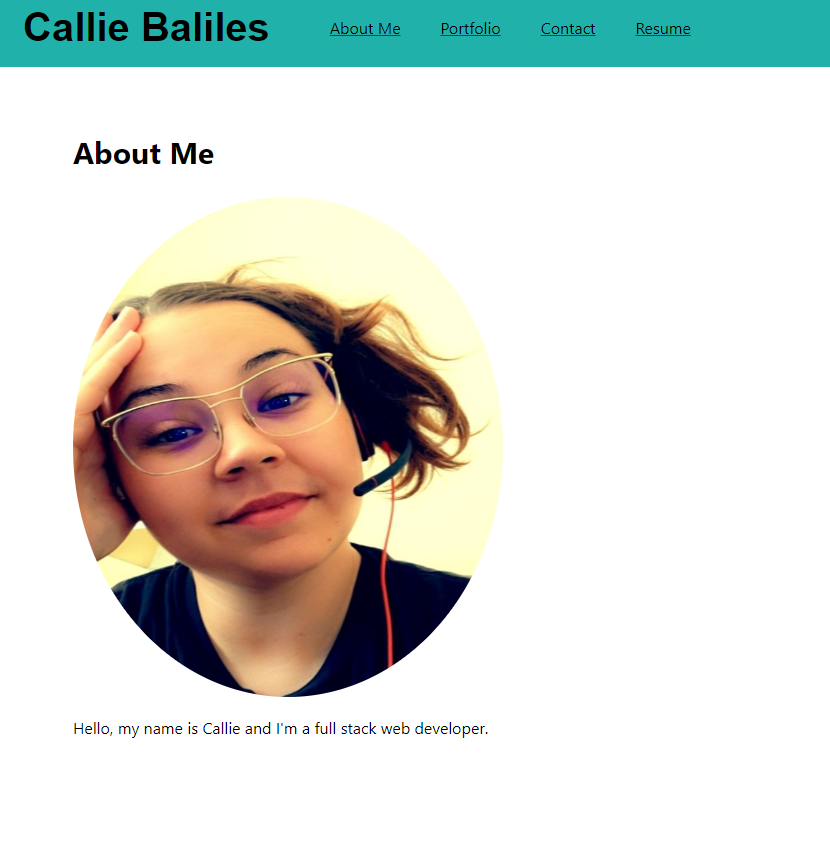
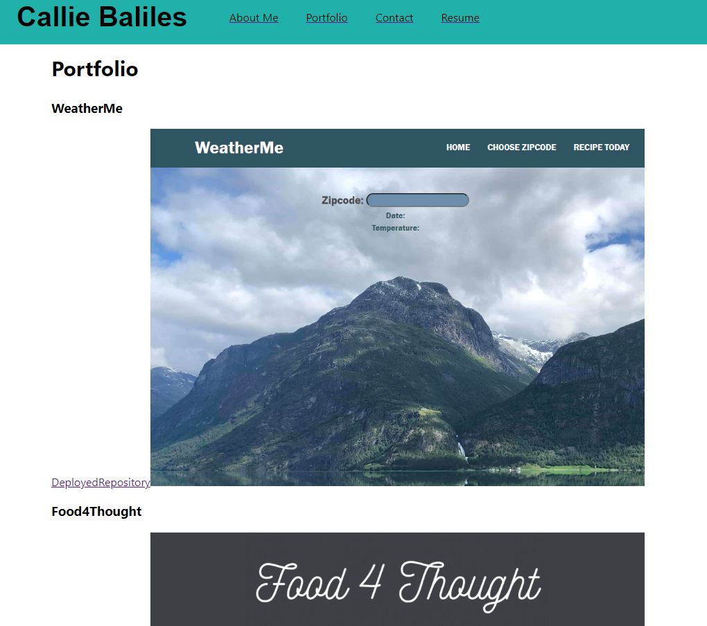
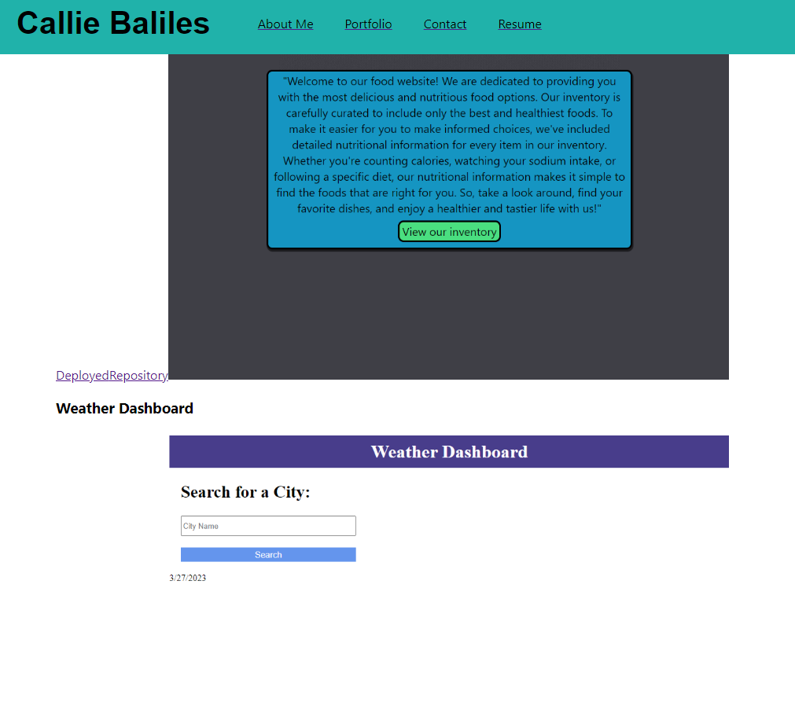
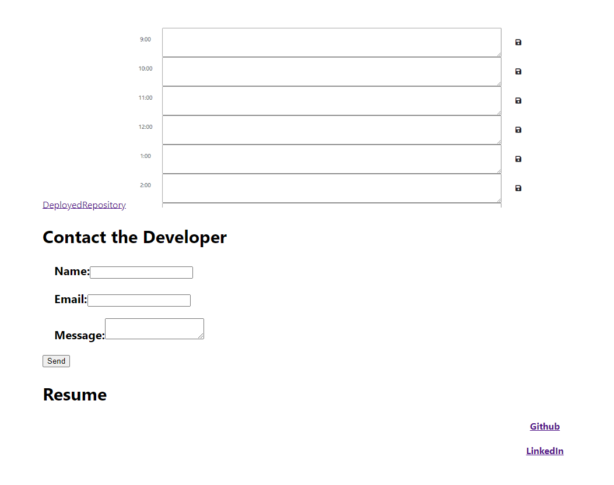

# W20C-reactportfolio

## Description

This is a professional portfolio, built with react, for potential employers.


## Usage

When the user visits the portfolio, they are taken to the main about me section. There is a navigation at the top with the options to visit about me, portfolio, conatct me, and resume. When you click on any item in the navigation, it will take you to the selected page element. There is a short description about the developer, screenshots and links to their work, a form to contact the developer, a link to their resume, and links to their GitHub and LinkedIn.


    ```md
    
    ```
    ```md
    
    ```
    ```md
    
    ```
    ```md
    
    ```
